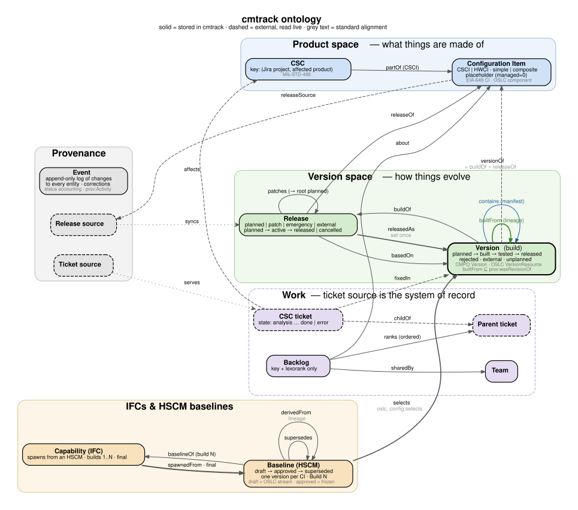
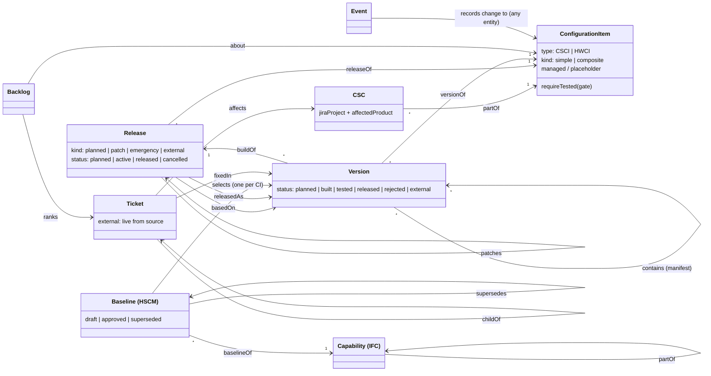

# cmtrack ontology

What cmtrack's terms mean and how they relate, lined up with the configuration management (CM) standards and
ontologies that already cover this ground. The formal version is [`cmtrack.ttl`](cmtrack.ttl) (OWL, Turtle).
This page is the readable one; if the two disagree, fix whichever is wrong.

(Diagram source: [`ontology.dot`](ontology.dot). Re-render with `dot -Tsvg ontology.dot -o ontology.svg`.)

## Prior work we build on

We don't need a new foundation. Four bodies of work already cover most of it, and each one covers a
different part:

| Source | What it gives us | Where we use it |
|---|---|---|
| **EIA-649C / MIL-HDBK-61A**, the DoD CM standard and its handbook | The authoritative vocabulary: CI, CSCI/HWCI, baseline, configuration status accounting, change request, variance | Names and definitions of CI, baseline and event |
| **MIL-STD-498** | The CSCI → CSC → CSU breakdown | CSC |
| **OSLC Configuration Management 1.0** (OASIS) | An RDF model separating a *concept* from its *versions*, and editable *streams* from frozen *baselines*, with `prov:wasRevisionOf` for version history | CI ↔ Version, draft vs approved baselines, lineage |
| **CMPO**, the Configuration Management Process Ontology (part of the SEON network, built on UFO) | A peer-reviewed OWL ontology of CM: *a CI has Versions*, *a Baseline packages Versions*, *a Change Request addresses CIs* | Confirms the core triangle CI / Version / Baseline |
| **W3C PROV-O** | Standard derivation relations (`wasDerivedFrom`, `wasRevisionOf`) and activities | Lineage, the event log |
| **Conradi & Westfechtel, "Version models for SCM"** (ACM Computing Surveys, 1998) | The split between *product space* (what a thing is made of) and *version space* (how it evolves: revisions vs variants) | The two axes below |
| **SPDX 3** relationship vocabulary | `contains`, `ancestorOf` and `descendantOf` for software bills of materials | Manifest and lineage, if we ever export SBOMs |

Also consulted: ISO 10303 AP239 (PLCS). It keeps a *part*, its *versions* and its *views* separate, and
distinguishes *as-designed* from *as-realized*. It's heavier than we need, but its "realized" idea is the
right home for "Version of an HWCI" when hardware revisions get built (see Gaps).

## Two axes

Following Conradi & Westfechtel, every term sits on one of two axes:

- **Product space (what something is made of):** CI, CSC, composite CI → child CIs, capability (IFC)
  hierarchy.
- **Version space (how it evolves over time):** Release, Version, lineage, Baseline.

A **Version** is where the two axes meet: it is one CI at one point in its evolution. Everything that
pins a configuration (manifests, baselines) points at Versions, never at CIs alone.

## Terms

### Product space

**Configuration Item (CI)** — `cmt:ConfigurationItem`, table `ci`
: A thing whose configuration is managed and released as a unit. Same meaning as EIA-649's CI, CMPO's
  *Configuration Item* and, in OSLC terms, a *component* (a unit of organization whose versions are tracked).
  - **CSCI** / **HWCI**: the software and hardware subclasses, disjoint (MIL-HDBK-61A).
  - **Simple** / **Composite**: a composite CI's versions are made of pinned versions of other CIs (see
    *contains*).
  - **Placeholder** (`managed = 0`): a CI we know about only because a scraped HSCM names it. It exists so
    baselines can refer to it; nobody manages its releases here.

**CSC (Computer Software Component)** — `cmt:CSC`, table `csc`
: A part of exactly one CSCI (MIL-STD-498), in practice owned by one team. cmtrack's defining addition:
  a CSC is *identified by* a (Jira project, affected product) pair, which is how tickets resolve to CSCs
  and CSCIs. CSCs are not versioned separately (per-CSC versions are listed under Gaps).

**Capability (IFC)** — `cmt:Capability`, table `ifc`
: A fielded capability, arranged in a hierarchy (`partOf`). It is the thing a baseline describes. It is not
  a CI: it is never versioned itself. Its configuration is the set of CI versions in its approved baseline.

### Version space

**Release** — `cmt:Release`, table `release`
: A planned delivery of one CI: a named target that builds are made towards, one of which gets promoted.
  - **Planned release**: a scheduled release (e.g. `2026.Q4`). Planned releases are ordered by target date.
  - **Patch** / **Emergency release**: a release that `patches` a planned release (always the *root* of the
    line) and is `basedOn` a released version. An emergency needs a `reason` (the change request).
  - **External release**: a release that exists only to hold versions scraped from an HSCM.
  - **Release line** (or *family*): a planned release plus every patch and emergency release on it. Its
    **effective version** is the latest version released anywhere in the line.

  > **Naming clash.** In EIA-649, *release* means "approved configuration documentation made available for
  > use", which is an event, not a container. cmtrack's Release is closer to a *release plan* or *delivery*.
  > We keep the word because it is what the teams (and Jira) say, but the promotion
  > (`Version → releasedAs`) is the part that matches the EIA-649 meaning.

**Version** — `cmt:Version`, table `version`
: One identified build of a CI, made within a release. This is CMPO's *Version* and OSLC's *version
  resource*, and it is the only thing that can be fielded, tested or pinned.
  - `versionOf` its CI (OSLC: `dcterms:isVersionOf`) and `buildOf` its release.
  - Lifecycle: `planned → built → tested → released`, with `rejected` possible from any pre-release state.
    `external` means we only know it from an HSCM.
  - **Released version**: the one version a release was `releasedAs`, fixed once set. Promotion is gated
    by the CI's `requireTested`.
  - **Unplanned version** (`planned = 0`): added by hand on a CI whose releases are synced. The README
    calls this a *variance*; see the note under Gaps.

**Lineage** (`builtFrom`) — `cmt:builtFrom`, table `version_parent`
: The DAG of which versions each build was made from. It specializes `prov:wasRevisionOf` (which OSLC uses
  for the same purpose). Usually a chain; a *merge* (a fix folded into a later release) gives a version two
  parents. `builtFrom+` (transitive) = *ancestor*, SPDX's `descendantOf`. A **range** `a..b` is
  ancestors(b) − ancestors(a).

**Manifest** (`contains`) — `cmt:contains`, table `manifest_entry`
: A composite CI's version *contains* specific child versions. That is its product structure, frozen at a
  point on the version axis (SPDX `contains`; OSLC *contribution*).

**Baseline (HSCM)** — `cmt:Baseline`, tables `baseline` + `baseline_entry`
: For one capability, a selection of exactly **one version per CI**. This is CMPO's "Baseline packages
  Versions" and OSLC's `oslc_config:selects`.
  - **Draft** ≈ an OSLC *stream*: editable.
  - **Approved** ≈ an OSLC/EIA-649 *baseline*: frozen, and changed only by cloning a new draft that
    `supersedes` it. Only released or external versions may be selected.
  - In EIA-649 terms it is closest to a **product baseline** as fielded for that capability. It is not a
    functional or allocated baseline: those baseline *requirements documents*, which cmtrack doesn't hold.
  - **Baselines behind**: approved baselines that select an older version than the release line's
    effective version.

### Work and change (external, read live)

**Ticket** — `cmt:Ticket` (not stored; the ticket source is the system of record)
: A **parent ticket** is the unit of work people report on. A **CSC ticket** is `childOf` a parent and
  `affects` exactly one CSC (resolved through its Jira pair); it is how one team implemented its part.
  `fixedIn` → the Version(s) it shipped in (Jira *fix version*). A ticket carrying a `reason`, or referred
  to by one, plays the role of a **change request** (CMPO's *Change Request addresses CIs*).
  Workflow **state** (`analysis_required` … `done`, `error`) is decided by the source.

**Work in a range**: the parent tickets whose CSC tickets are `fixedIn` some version in `a..b`. This is
what cmtrack contributes that the source can't compute.

**Backlog** — `cmt:Backlog`
: A ranked list of parent tickets, `sharedBy` teams and `about` CIs. It stores only key and rank.

### Provenance

**Event** — `cmt:Event`, table `event`
: One append-only record of a change. Together, the events are EIA-649's **configuration status
  accounting**. Aligned with `prov:Activity`. A **correction** is an event that changes what we recorded
  as having happened (`built_at`, `released_at`) and carries a note.

**Release source** / **Ticket source** — `cmt:ReleaseSource`, `cmt:TicketSource`
: External systems of record (`prov:Agent`). Synced rows keep the source's key. **Pinned** fields are ones
  a person overrode, and **missing** rows are ones the source stopped listing. Both record whose word we're
  taking, which is provenance.

## Relations at a glance

| Relation | Domain → Range | Card. | Standard alignment |
|---|---|---|---|
| `partOf` | CSC → CSCI | * → 1 | MIL-STD-498 decomposition |
| `partOf` | Capability → Capability | * → 0..1 | |
| `releaseOf` | Release → CI | * → 1 | |
| `buildOf` | Version → Release | * → 1 | |
| `versionOf` | Version → CI | * → 1 | `dcterms:isVersionOf` (OSLC), CMPO *CI has Version* |
| `builtFrom` | Version → Version | * → * | ⊑ `prov:wasRevisionOf`; SPDX `descendantOf` |
| `contains` | Version (composite) → Version | * → * | SPDX `contains`, OSLC contribution |
| `patches` | Release (patch/emergency) → Release (planned) | * → 1 | |
| `basedOn` | Release (patch/emergency) → Version | * → 0..1 | ⊑ `prov:wasDerivedFrom` |
| `releasedAs` | Release → Version | 1 → 0..1, immutable | EIA-649 *release* (the act) |
| `baselineOf` | Baseline → Capability | * → 1 | |
| `selects` | Baseline → Version | 1 → *, one per CI | `oslc_config:selects`, CMPO *packages* |
| `supersedes` | Baseline → Baseline | 0..1 → 0..1 | `prov:wasRevisionOf` |
| `affects` | CSC ticket → CSC | * → 1 | |
| `fixedIn` | Ticket → Version | * → * | |
| `childOf` | CSC ticket → parent ticket | * → 1 | |
| `ranks` | Backlog → parent ticket | * → * (ordered) | |

**Rules the ontology should carry** (the formal file encodes the ones OWL can express. The rest are
enforced in `service.py`):

- A version's CI is its release's CI: `versionOf = buildOf ∘ releaseOf` (an OWL property chain).
- `builtFrom` and `contains` never cross this rule: lineage stays within one CI, and manifests point at
  *other* CIs.
- A baseline selects at most one version per CI. An approved baseline selects only released/external
  versions and never changes.
- `patches` always points at a line's root planned release, and the release it points at is never itself a
  patch.

## Gaps and recommendations from the literature

1. **"Variance" is used loosely.** EIA-649 variances (deviations, waivers) are *authorized departures from
   requirements*. A hand-added build is a departure from the *plan*. Suggest renaming it to
   **unplanned version** in UI and docs, so "variance" stays free if real deviations/waivers ever need
   tracking.
2. **Change requests are implicit.** CMPO and EIA-649 treat the change request (ECP/CR) as first class,
   with its own lifecycle. Today it's the free-text `reason` or a Jira ticket. If emergencies need audit,
   make `reason` a ticket reference (`cmt:justifiedBy → Ticket`).
3. **Verification.** Already on the roadmap. PROV and AP239 both model it as an activity that *used* a
   version and *generated* a result, which fits `cmt:Event` well.
4. **Effectivity.** EIA-649's effectivity says *which units or dates a configuration applies to*. Baselines
   per capability cover part of this. If hardware serials or dates ever matter, that's the missing concept.
5. **Hardware realization.** AP239 separates a *part version* (design) from a *realized part* (the
   serialized thing). For HWCIs, a "Version" is the design revision. Serial numbers would be a new class,
   not more Versions.
6. **Capability ↔ CI membership** (`ifc_ci`, planned) would give `Capability → comprises → CI`. That
   relation lets you check that a baseline selects a version for *every* CI the capability comprises
   (what EIA-649 calls an audit).

## References

- SAE/EIA-649C, *Configuration Management Standard*; [MIL-HDBK-61A(SE), *Configuration Management Guidance*](https://www.acqnotes.com/Attachments/MIL-HDBK-61A%20(SE)Configuration%20Management%20Guidance.pdf)
- MIL-STD-498, *Software Development and Documentation* (CSCI/CSC/CSU)
- [OSLC Configuration Management 1.0, Part 1: Overview](https://docs.oasis-open-projects.org/oslc-op/config/v1.0/oslc-config-mgt.html) and [Primer](https://docs.oasis-open-projects.org/oslc-op/config-primer/v1.0/config-primer.html)
- [CMPO, Configuration Management Process Ontology (SEON)](https://dev.nemo.inf.ufes.br/seon/CMPO.html)
- [W3C PROV-O](https://www.w3.org/TR/prov-o/)
- R. Conradi, B. Westfechtel, [*Version Models for Software Configuration Management*](https://users.ece.utexas.edu/~perry/education/SE-Intro/vmscm.pdf), ACM Computing Surveys 30(2), 1998
- [SPDX 3.0.1 RelationshipType](https://spdx.github.io/spdx-spec/v3.0.1/model/Core/Vocabularies/RelationshipType/)
- ISO 10303-239 (AP239 PLCS), [ed3 white paper](https://www.ap239.org/c/document_library/White_Paper_AP239_ed3.pdf)
